<h1 align="center">
  
   
  基于计算机视觉的智慧养老系统
</h1>

  Intelligent elderly care system based on computer vision

  
  
 <!---->
  
    
  

基于计算机视觉的智慧养老系统通过（模拟）多组摄像头实时拍摄到的画面，用计算机视觉技术实时分析老人的情感、是否有人摔倒、是否有人闯入禁止区域、老人是否有和义工互动、是否有陌生人出现并追踪陌生人。一旦上述事件发生，该事件会立即插入到数据库中。这些事件数据被实时地更新在报表中，管理人员因此可以迅速做出反应，从而可以提高管理人员的服务水平和管理能力。

本系统分为2部分，分别是 Web 用户界面  和基于计算机视觉的摄像头（群组）。其中，系统 Web 用户界面仅供系统管理员使用。系统管理员使用该系统不仅可以管理老人、工作人员和义工的信息，包括录入、查看等，还可以查看实时监控以及得到实时的事件报警，如陌生人入侵、陌生人追踪等。Web 用户界面的功能结构图如下图所示：

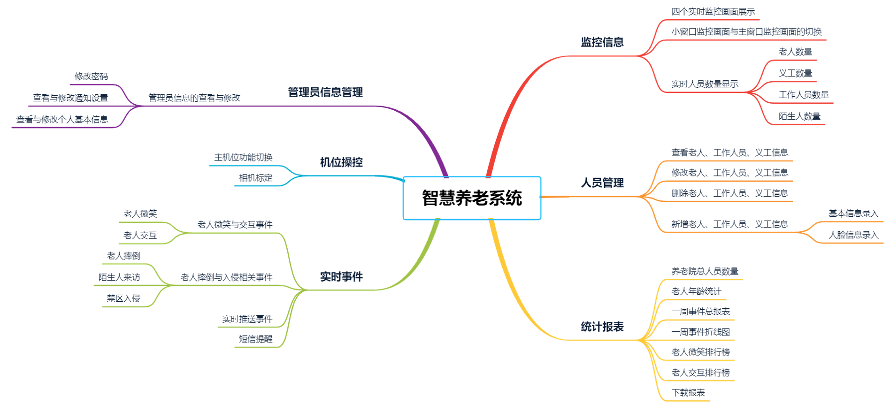

本文重点介绍该项目中摄像头（群组）负载的计算机视觉任务及其算法实现。根据项目需求，设计了如图所示的系统安装环境。办公室的摄像头用于收集人脸数据；房间的摄像头检测陌生人和老人微笑，走廊的摄像头检测是否有人摔倒，活动室的摄像头放在桌子上，当有义工访问才拿出来使用，同时在活动室安装标定板（用于获得世界坐标系与像素坐标系的映射关系），院子的摄像头监控是否有人闯入禁止区域。

<ul class="qubely-list qubely-list-type-unordered qubely-list-bullet-check"><li>Nginx-RTMP与直播推流</li></ul>

在实时监控方面，搭建 Nginx-RTMP 直播推流服务器。Nginx 是一个非常出色的 HTTP 服务器, FFMPeg 是非常好的音视频解决方案。这两个东西通过一个 Nginx 的模块 nginx-rtmp-module, 组合在一起即可以搭建一个功能相对比较完善的流媒体服务器。这个流媒体服务器可以支持RTMP和HLS(Live Http Stream)。

RTMP 在互联网 TCP/IP 五层体系结构中应用层，RTMP 协议是基于TCP协议的，是面向连接的协议，能够为数据的传输提供可靠保障，因此数据在网络上传输不会出现丢包的情况。不过这种可靠的保障也会造成一些问题，也就是说前面的数据包没有交付到目的地，后面的数据也无法进行传输。系统的视频流传输结构如图所示。

<ul class="qubely-list qubely-list-type-unordered qubely-list-bullet-check"><li>单样本学习与人脸识别
</li></ul>

在人脸识别的情况下，模型或系统可能只有一个或几个给定人脸的样本，并且必须从新照片中正确识别出该人，包括在表情、发型、光照和首饰等都有所变化的情况下。因此，人脸识别是单样本学习的常见例子之一  。

现代人脸识别系统通过学习丰富的低维特征表示方法（称为人脸嵌入）来解决通过人脸识别进行单样本学习的问题。这种低维特征表示可以很容易地计算出人脸，并在验证和识别任务中进行比较。

从历史上来看，嵌入是通过使用孪生网络（Siamese network）来解决单样本学习问题的。通过对具有对比损失（Comparative Loss）函数的孪生网络进行训练，获得了更好的性能，后来导致了 Google 在 FaceNet 系统中使用三重损失（Triplet Loss）函数，这个函数在基准人脸识别任务取得了当时最先进的结果。

如图所示，传统 CNN 包含卷积层、全连接层等组件，并采用 softmax 多类别分类器和多类交叉熵损失函数。

孪生神经网络是单样本学习中最具代表性的模型。孪生网络是由两个并行神经网络构成的架构，每个神经网络采用不同的输入，其输出被组合起来以提供一些预测。这个网络的两个子网络相同（不同则为伪孪生神经网络），两个子网络有相同的参数和权重。其目标是寻找两个可比较对象的相似程度（例如，签名验证、人脸识别等）。

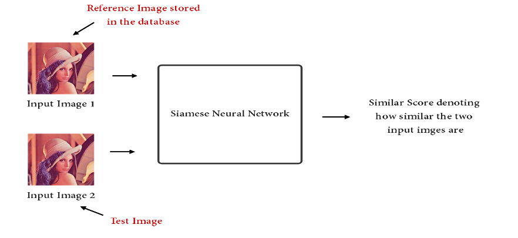

学习像图像这样的复杂输入的向量表示就是降维的一个例子。有效降维的目标是学习一种新的低维表示，它保留了输入的结构，使得输出向量之间的距离能够有意义地捕捉到输入中的差异。然而，向量必须捕获到输入中的不变特征。降维是孪生网络用于解决单样本学习的方法。

Raia Hadsell 等人在 2006 年发表的一篇题为《学习不变映射的降维》（《Dimensionality Reduction by Learning an Invariant Mapping》）论文中，探讨了利用具有图像数据的卷积神经网络进行孪生网络降维，并提出了通过对比损失对模型进行训练的方法。与在训练数据集中的所有输入样本中评估模型性能的其他损失函数不同，对比损失是在成对的输入之间计算的，例如提供给孪生网络的两个输入之间。对比损失是在成对的输入之间计算的，例如提供给孪生网络的两个输入之间。

成对的样本被提供给网络，损失函数根据样本的类别是相同的还是不同对模型进行不同的惩罚。具体来说，如果类是相同的，损失函数就鼓励模型输出更为相似的特征向量，而如果类不同的话，那么损失函数就会鼓励模型输出不太相似的特征向量。因此，对比损失可用来训练人脸识别系统，特别是用于人脸认证的任务。

对比损失的概念可以进一步扩展，从两个样本扩展到三个样本，称为三重损失。Google 的 Florian Schroff 等人在 2015 年发表的论文《FaceNet：人脸识别和聚类的统一嵌入》（《FaceNet: A Unified Embedding for Face Recognition and Clustering》）中介绍了三重损失。

Triplet 是一个三元组，这个三元组是这样构成的：从训练数据集中随机选一个样本，该样本称为 Anchor，然后再随机选取一个和 Anchor 属于同一类的样本和不同类的样本,这两个样本对应的称为 Positive 和 Negative，由此构成一个（Anchor，Positive，Negative）三元组。损失函数对模型进行惩罚，减小匹配样本之间的距离，增加了非匹配样本之间的距离。

这种方法是 FaceNet 系统的基础。FaceNet 是一个通用的系统，可以用于人脸验证，识别和聚类，它直接学习图像到欧式空间上点的映射，两张图像所对应的特征的欧式空间上的点的距离直接对应着两个图像的相似程度。

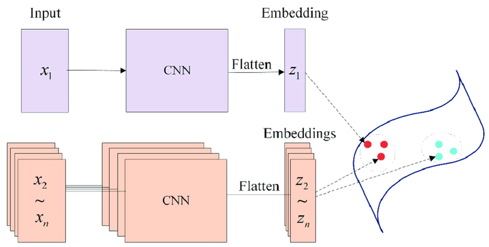

在本系统中，人脸验证的思路是通过人脸检测器将人脸从图像中提取出来，通过Facenet 进行验证。如下图所示：

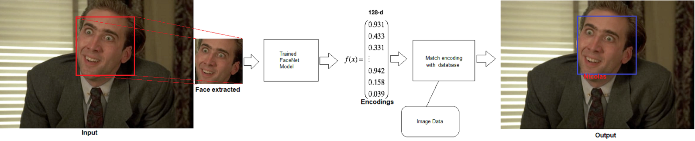

对比了不同的人脸检测器，发现OpenCV中提供的DNN运行速度快，对遮挡等情况适用。

<table class="tg">
<thead>
  <tr>
    <th class="tg-nrix">检测器</th>
    <th class="tg-nrix">第三方库</th>
    <th class="tg-nrix">CPU</th>
    <th class="tg-nrix">非正面和遮挡 </th>
  </tr>
</thead>
<tbody>
  <tr>
    <td class="tg-nrix">Haar </td>
    <td class="tg-nrix">OpenCV</td>
    <td class="tg-nrix">实时 </td>
    <td class="tg-nrix">不起作用 </td>
  </tr>
  <tr>
    <td class="tg-nrix">DNN </td>
    <td class="tg-nrix">OpenCV </td>
    <td class="tg-nrix">实时 </td>
    <td class="tg-nrix">适用 </td>
  </tr>
  <tr>
    <td class="tg-nrix">HoG </td>
    <td class="tg-nrix">Dlib </td>
    <td class="tg-nrix">最快 </td>
    <td class="tg-nrix">轻微遮挡和稍不正面</td>
  </tr>
  <tr>
    <td class="tg-nrix">CNN </td>
    <td class="tg-nrix">Dlib </td>
    <td class="tg-nrix">很慢 </td>
    <td class="tg-nrix">适用</td>
  </tr>
</tbody>
</table>

不同人脸检测器的效果如下图所示

此外，从用户角度出发，在建立人脸数据库时，通过 OpenCV 和 win32com 从文字和语音方面进行操作提示。

<ul class="qubely-list qubely-list-type-unordered qubely-list-bullet-check"><li>Mini-Xception 与微笑检测
</li></ul>

在微笑检测上，我们使用了基于fer2013数据集的Mini-Xecption模型，该模型移除了全连接层，结合了残差模块和深度可分离卷积减少参数，达到实时检测的目的。

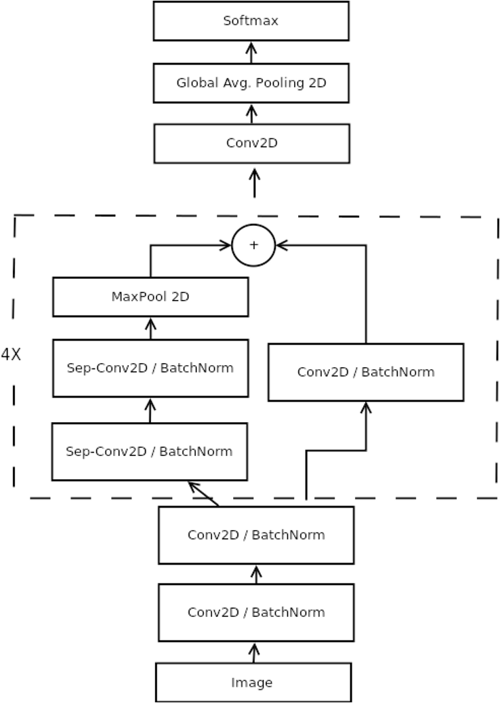

😀 移除全连接层：VGG16 中90%的参数位于全连接层，与 AlexNet 相比，Mini-Xception 参数从 60M 减少到了 600,000

😀 结合了 residual modules 和 depth-wise separated convolutions

-  residual modules enable the gradients better back-propagate to lower layers
- depth-wise separated convolutions spatial cross-correlations are separable convolutions channel cross-correlations. Therefore the number of parameters is further reduced in convolutional layers

<ul class="qubely-list qubely-list-type-unordered qubely-list-bullet-check"><li>人脸识别综合算法
</li></ul>

综上，我们首先建立人脸数据库，通过人脸检测器提取出图片中的人脸进行处理，利用 Facenet 计算新图片中人脸与数据库中人脸的欧式距离  ，若最小值大于选定的阈值（基于 KNN 和 SVM），则发出陌生人警告，反之，若新图片中的人脸为老人，则通过 Mini-Xception 选择置信度最大的情绪识别结果。算法结构如下图所示。

<ul class="qubely-list qubely-list-type-unordered qubely-list-bullet-check"><li>物体运动特征与摔倒检测
</li></ul>

摔倒检测方面，从单幅图像上来看，我们可以提取出人的高度、宽度和夹角信息。

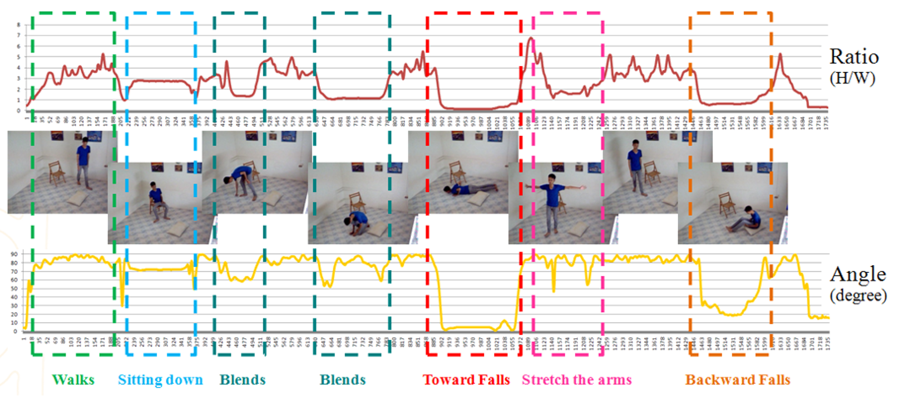

从时间序列上来看，除了上述特征，我们还可以提取出速度和加速度，摔倒行为的特征表现如图所示。

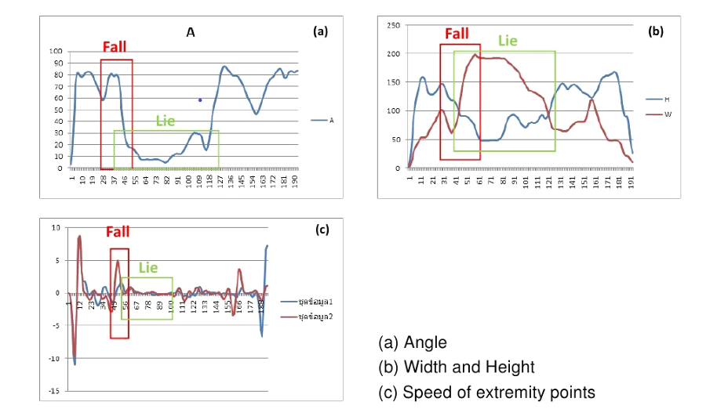

在  中使用的背景差分法，由于易受到摄像头摆动等因素干扰而影响测量准确度。

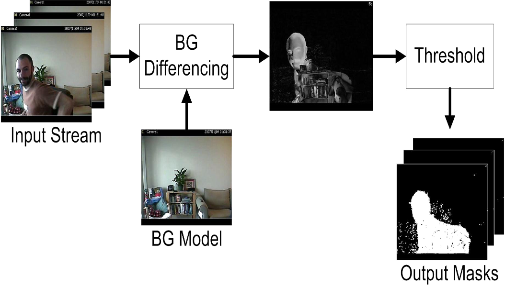

故在本项目中使用 OpenPose 提取人体关键点从而提取人体运动特征。OpenPose 是由 C++ 开发的开源库，可用于实时人体姿态估计等，为了在python 中使用，需要对其进行编译。（在  提供了基于 Windows 10 + Python 3.7.4 + vs2017 +cmake 3.18.0 + OpenPose 1.6 + CUDA 10.0 +cudnn -10.0-windows10-x64-v7.6.5.32 的编译结果，自行编译请参考  ）

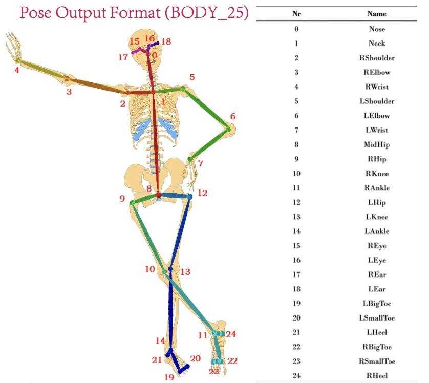

但 OpenPose 在人体姿势极端的情况下，识别准确度下降，为识别摔倒的老人通过挥手臂等方式求救，我们实现了基于人体关键点和背景差分的摔打检测算法，利用人力关键点提取出速度、高度、宽度等描述特征，当发生异常通过背景差分提取出角度特征，当特征连续多次满足摔倒检测阈值时，则发出摔倒报警。算法结构如图所示。

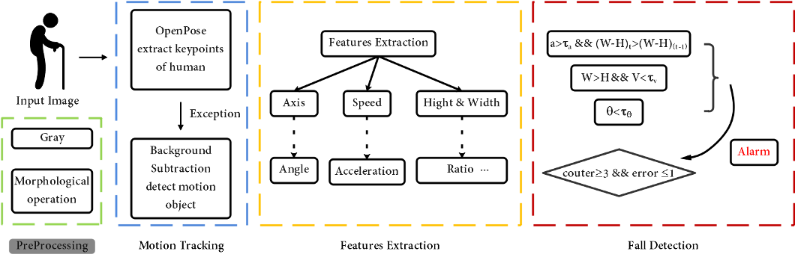

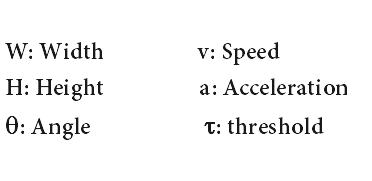

该摔倒检测算法的效果如下

<a href="https://youtu.be/H7GJdEIA9iM" rel="nofollow">

</a>

<ul class="qubely-list qubely-list-type-unordered qubely-list-bullet-check"><li>系统标定与互动检测
</li></ul>

在互动检测上，我们假定老人与义工的距离小于50cm即发生互动。因此需要建立像素坐标系与世界坐标系的映射关系。伪随机序列具有良好的窗口特性，即通过一个较小的窗口在编码图案上面移动时，每个窗口内的编码组合是唯一的，根据窗口的这个特性可以唯一地辨识编码图案上的特征点。

以  作为本原多项式生成伪随机序列，通过伽罗华域下的四则运算，生成  的伪随机矩阵，窗口大小为 。 

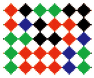                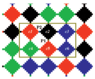                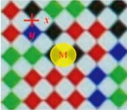

编码图案以菱形作为基本图案，菱形的角点作为特征点，以红、蓝、绿、黑四种颜色作为菱形的颜色。分别对应矩阵中的不同数值，通过颜色及位置对特征点进行编码，从而可以唯一确定图案中某一角点的位置，进而确定不同角点在世界坐标系下的相对位置。

通过设计的解码算法，可以将角点位置精确到亚像素，在Lab演色空间下进行颜色分类，完成解码。

- 确定候选特征点：
- 确定特征点：
- 8邻域广度优先搜索将特征点位置精确到亚像素
- 色彩校正、Lab 颜色空间对菱形颜色分类并解码

标定部分算法结构可参考下面伪代码：

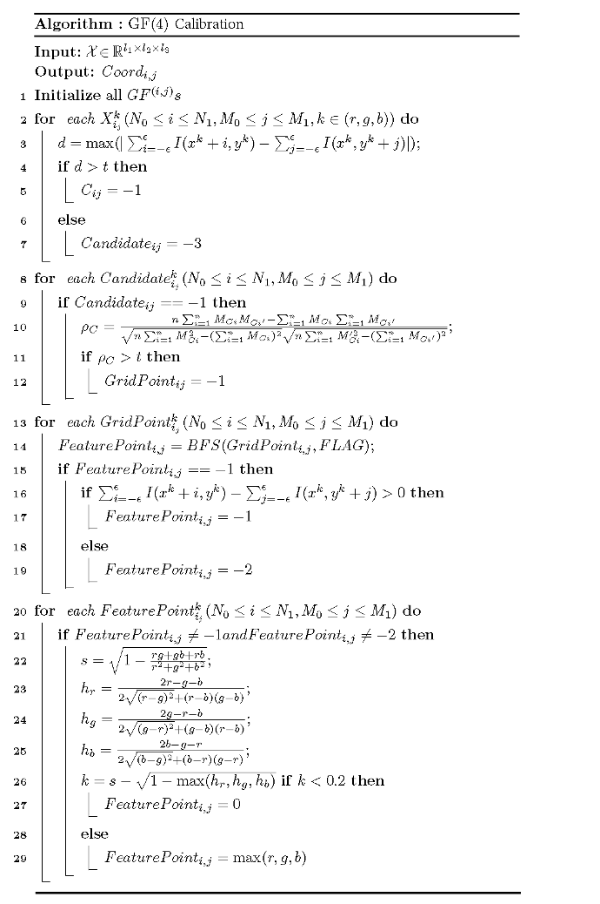

如图分别为拍摄原图，角点位置和颜色分类结果。

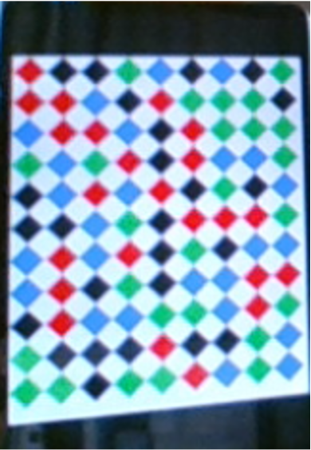                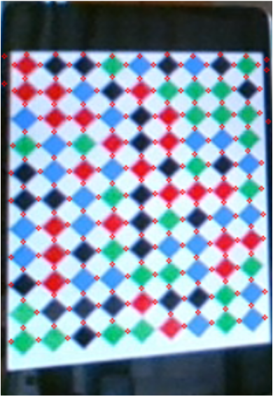                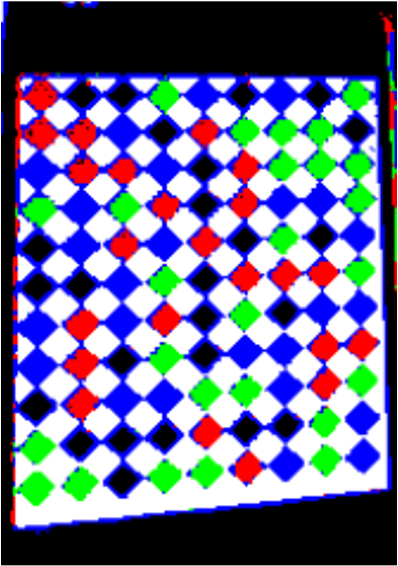

<ul class="qubely-list qubely-list-type-unordered qubely-list-bullet-check"><li>移动物体监测与跟踪
</li></ul>

在禁止区域入侵监测方面，包括物体监测和物体追踪两部分。在本项目中，物体检测的目的是识别出人这个物体，而物体追踪则是追踪画面中检测到的人。在对比了不同物体检测方法（如 R-CNN、YOLO等）后，出于实时性和准确性的考虑，选择了质心跟踪算法。其算法步骤如图所示。

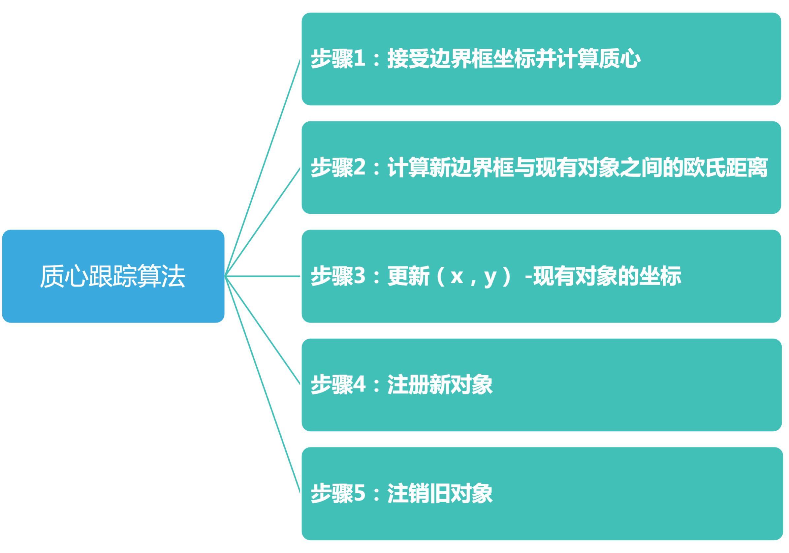

## Features
- [x] OpenCV 人脸检测器识别人脸，拍照录入人脸信息
- [x] win32com.client 语音提示
- [x] FaceNet 单样本人脸识别
- [x] Mini-Xception 基于 fer2013 数据集的表情识别
- [x] 综合 Face Detector+FaceNet+Mini-Xception 的老人微笑检测+陌生人检测（Happy-Elder-Care-Net）
- [x] 提供基于 Python 3.7.4 + vs2017 +cmake 3.18.0 + OpenPose 1.6 + CUDA 10.0 +cudnn -10.0-windows10-x64-v7.6.5.32 的编译结果
- [x] 基于 Windows 10 + OpenPose + Background Subtraction 计算人体高度、宽度、角度、速度等指标的摔倒检测
- [x] 基于 GF(4) 标定的交互检测
- [x] 基于质心跟踪的入侵检测和追踪
- [x] 基于 Nginx-RTMP 的直播推流
